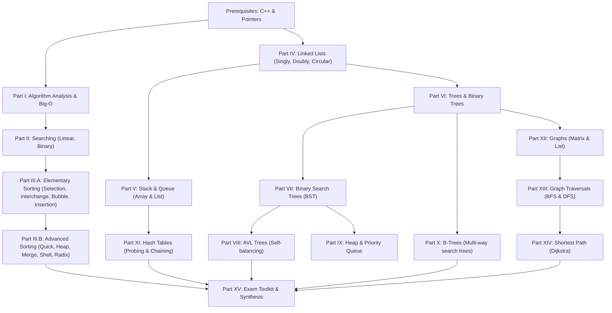

# IT003_SYLLABUS_MAP.md — IT003 Curriculum Reconstruction

> **Comprehensive Knowledge Mapping & Dependency Graph**
> IT003 — Data Structures & Algorithms, University of Information Technology (UIT-VNUHCM).

---

## 1. Classification Matrix

### [CORE]
- Pointer & Dynamic Memory Allocation in C++
- Algorithm Analysis & Big-O Notation ($\mathcal{O}, \Omega, \Theta$)
- Elementary Sorting (Selection, Interchange, Bubble, Insertion)
- Advanced Sorting (Quick Sort, Heap Sort, Merge Sort)
- Linear Data Structures (Singly Linked List, Doubly Linked List)
- Stack & Queue (Array-based, Pointer-based, Circular Queue)
- Trees & Binary Search Tree (BST: Search, Insert, Delete)

### [MUST KNOW]
- Binary Search & Search Complexity Bounds
- Binary Insertion Sort & Shell Sort
- Balanced BST: AVL Tree (LL, RR, LR, RL Rotations & Balance Factors)
- B-Tree (Order $m$, Key insertion, Node split & promotion, Redistribution & Merge)
- Hash Table (Hash functions, Probing: Linear, Quadratic, Double Hashing, Chaining)
- Graph Representations (Adjacency Matrix, Adjacency List)
- Graph Traversals (BFS with Queue, DFS with Stack/Recursion)
- Shortest Path Algorithms (Dijkstra Algorithm)

### [EXAM HIGH FREQUENCY]
- Manual Tracing of Sorting Steps & Exact Count of Comparisons / Swaps ($C, M$)
- BST Deletion with 2 children (Tracing exact tree state after deletion)
- AVL Rotation Tracing (Identifying imbalance node & executing 1-step or 2-step rotation)
- B-Tree Insertion & Splitting (Order 5 B-Tree step-by-step state)
- Hash Table Insertion & Search Comparison Count ($C_{	ext{succ}}, C_{	ext{unsucc}}$)
- Graph BFS/DFS Visitation Sequence & Queue/Stack state
- Dijkstra Table Tracing step-by-step

### [PREREQUISITE]
- C++ Basics (Variables, Control flow, Structs, Functions, References `&`, Pointers `*`)
- Dynamic Memory Management (`new`, `delete`, `nullptr`, memory leak prevention)

### [EXTENSION & OPTIONAL]
- Radix Sort (Counting / Bucket intuition)
- Heap & Priority Queue (Max Heap, Min Heap, `std::priority_queue`)
- Bellman-Ford & Floyd-Warshall Algorithms (Shortest paths with negative weights)
- C++ STL Containers (`std::vector`, `std::list`, `std::stack`, `std::queue`, `std::unordered_map`, `std::map`)

---

## 2. Dependency Graph

